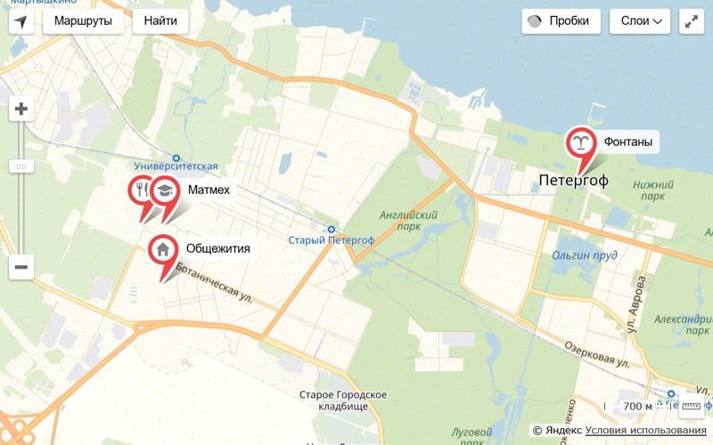
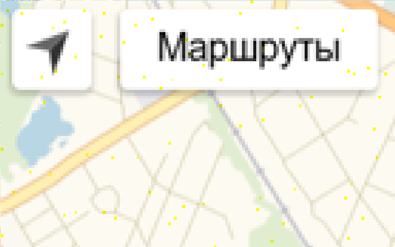

## Task #2: *Location map* :moyai:

    1. Receive email with `noname` file

    2. Extract meta-information from this png
        2.1 Notice `comment: 336207159431...` field with 12288 decimal digits in a row
    3. Take a closer look at the picture
        3.1 Notice a lot of pixels with yellow shade

    4. Parse string of digits in pixels' coordinates: [(xxx, yyy), ...]
    5. Collect blue channel from them all in one hex-string: `4d5a9000030000...`
    6. Write its in file: `MZ\x90\x00\x03\x00\x00...`
    7. Run this PE-file and get link

